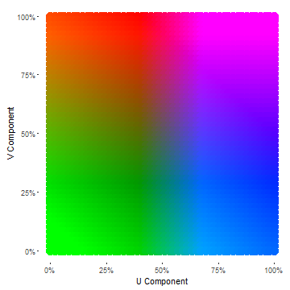

# colorplaner

[](https://travis-ci.org/wmurphyrd/colorplaner)


The colorplaner R package is a ggplot2 extension to visualize two variables through one color aesthetic via mapping to a color space projection. The extension implements two new scales, `scale_color_colorplane` and `scale_fill_colorplane`, two new aesthetics, `color2` and `fill2`, and a new guide `guide_colorplane`. 

## Motivation

While Edward Tufte praises map visualizations as inherently high in
dimensionality due
to their geographic data, 
in practice maps are generally limited to no more than 
a single variable as a fill color without becoming uninterpretable. 

The colorplaner package is an exploration into the possibility of using a 
single color aesthetic to convey the values of multiple variables in an interpretable way. While designed with map visualizations in mind it will work anywhere that a color gradient scale would work, thanks to the
flexibility of ggplot2 extensions. 

## Concept

The spectrum of visible colors can be represented as a variety of different color spaces, and most of these use three parameters to define an individual color and thus can be represented as a 3-dimensional volume with a different color at each {x, y, z} point. While this could easily facilitate mapping three data variables to color using any arbitrary color space system, the results are not necessarily intuitively interpretable to the viewer. 

The YUV color space ([wikipedia](https://en.wikipedia.org/wiki/YUV)) was designed at the advent of color television broadcasting to encode color data in a manner that would be backwards-compatible with black & white sets. To do this, the luminance of each pixel is encoded into one component (Y), which provides all of the information used by black & white displays, and all of the color information (chrominance) is encoded into the remaining two components (U & V). 

When Y is held constant, remaining color space is a U-V *plane* with corners of saturated green, orange, fuchsia, and blue and smooth gradients in between. 




## Installation

To install:


```r
devtools::install_github("wmurphyrd/colorplaner")
```

#### Known Issues and Incomplete Features
* Cannot alter title and axis label positions in guide_colorplane (#2)
* Colors render incorrectly when discrete variables assigned to color/colour/fill (#1) 

#### Version 0.0.0.9003
* NEW: color projection customization options in `scale_color_colorplane` and `scale_fill_colorplane`! (#3)
    * Can specify a `Y` value for default `YUV` projection to set the luminosity
    * Can specify `color_projection = "red_blue"` for a red, blue, and purple scale
    * Can create any arbitrary scale with `interpolate_projection`

#### Version 0.0.0.9002
* Removed dependency on `pkg:colorscience` (and all of its imports and depends); replaced with super fast matrix-math YUV-RGB conversions (#4)
* Added missing arguments to `scale_fill_colorplane`: `na.color`, `trans`

#### Version 0.0.0.9001
* Removed all dependencies on unexported objects from ggplot2

#### Version 0.0.0.9000
* Adds `scale_color_colorplane`, `scale_fill_colorplane`, and `guide_colorplane` extensions to ggplot2

## Usage

To implement color plane mapping in a `ggplot`, simply create aesthetic mappings to `color` and `color2` or `fill` and `fill2` and add the corresponding color plane scale to the plot. The corresponding guide is added by default. 


```r
data(mtcars)
ggplot(mtcars, aes(x = wt, y = mpg, color = disp, color2 = hp)) +
  geom_point(size = 5) +
  scale_color_colorplane() 
```


```r
if(require(mapproj)) {
  crimes <- data.frame(state = tolower(rownames(USArrests)), USArrests)
  states_map <- map_data("state")
  ggplot(crimes, aes(map_id = state, fill = Murder, fill2 = UrbanPop)) +
    geom_map(map = states_map) +
    scale_fill_colorplane() +
    expand_limits(x = states_map$long, y = states_map$lat) +
    coord_map() 
}
```


## Settings

Like ggplot2, colorplaner works with sensible defaults but allows ample tweaking to get the output just right. Refining the above crime map, we alter the plot in the following ways:

1. Alter plot theme to remove unnecessary positional scales from the main plot (`axis.text`, `axis.ticks`) and move the guide below the map (`legend.position`). 
2. Override the above plot theme setting in the guide to retain its scales (`label.theme`, `label_y.theme`)
4. Improve the guide titles (`axis_title`, `axis_title_y`, `title`)
3. Improve the guide vertical axis labels (`fill2`, `labels_y`)
4. Force the percentage based scale to range from 0% to 100% (`limits_y`). 
5. Change to a different color space projection (`color_projection`, see `?color_projections` for more)

View `?scale_color_colorplane` and `?guide_colorplane` for all available options. 


```r
if(require(mapproj)) {
  crimes <- data.frame(state = tolower(rownames(USArrests)), USArrests)
  states_map <- map_data("state")
  ggplot(crimes,
         aes(map_id = state, fill = Murder, fill2 = UrbanPop/100)) +
    geom_map(map = states_map) +
    scale_fill_colorplane(labels_y = scales::percent,
                          axis_title = "Murder arrests\nper 100,000 people",
                          axis_title_y = "Percent Urban Population",
                          limits_y = c(0,1),
                          color_projection = "red_blue") +
    expand_limits(x = states_map$long, y = states_map$lat) +
    coord_map() +
    theme(legend.position = "bottom",
          panel.background = element_blank(),
          axis.text = element_blank(),
          axis.ticks = element_blank(),
          text = element_text(size = 9)) +
    labs(x = "", y = "", title = paste("1973 U.S. Arrest Data:\nMurder Rate",
                                       "v. Urban Population by State")) +
    guides(fill = guide_colorplane(
      title = "State Color Key",
      label.theme = calc_element("axis.text", theme_gray()),
      label_y.theme = calc_element("axis.text", theme_gray())))
}
```


