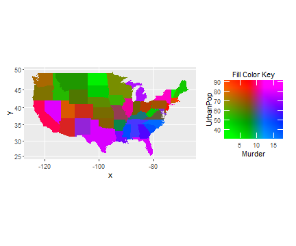
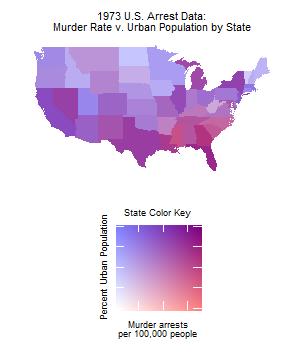

# colorplaner

[](https://travis-ci.org/wmurphyrd/colorplaner)
[](https://coveralls.io/github/wmurphyrd/colorplaner?branch=master)
[](https://cran.r-project.org/package=colorplaner)
[](https://cran.r-project.org/package=colorplaner)


The colorplaner R package is a ggplot2 extension to visualize two variables through one color aesthetic via mapping to a color space projection. With this technique for 2-D color mapping, one can create a dichotomous choropleth in R as
well as other visualizations with bivariate color scales. The extension implements two new scales, `scale_color_colorplane` and `scale_fill_colorplane`, two new aesthetics, `color2` and `fill2`, and a new guide `guide_colorplane`. 


## Installation

To install:


```r
# CRAN Version:
install.packages("colorplaner")
# Current development version: 
devtools::install_github("wmurphyrd/colorplaner")
```

#### Version 0.1.2
* Fixed an issue that was preventing updated vignettes from building
* Complete versions of `colorplaner` and `other_projections` vignettes 
now included

#### Version 0.1.1
* Initial release of the colorplaner package
* Implements two new gglot2 scales: `scale_color_colorplane` and 
`scale_fill_colorplane`
* Implements one new ggplot2 guide: `guide_colorplane`


## Motivation

In _The Visual Display of Quantitative Information_, Edward Tufte praises 
cartographic visualizations as inherently highly
dimensional due to their geographic data. However, in practice these
visualizations
are generally not used to describe the intricacies of borders but
instead to portray specific properties of geographic regions. In this sense,
the typical choropleth is limited to only a single data dimension displayed
as the filled-in color of the regions through a gradient or qualitative color scale. 

The colorplaner package is an exploration into increasing the
dimensionality of color-based aesthetic mapping in data visualizations. 
If color can be used to effectively and intuitively convey the information 
contained in two variables, then an additional dimension can be
added to choropleths or any visualization using color. As the typical color
gradient scale is one-dimensional and is defined with the
ubiquitous color bar guide, the addition of a second variable would create a
two-dimensional color scale that would
necessitate a *plane* of colors to guide interpretation. 

## Concept


The spectrum of possible colors can be defined though a variety of different color space systems. Many of these use three parameters to define an individual color and thus can be represented as a 3-dimensional volume with a different color at each {x, y, z} point. While this could facilitate mapping three data variables to color using any arbitrary color space system, the results would not necessarily be readily interpretable. 

The YUV color space ([wikipedia](https://en.wikipedia.org/wiki/YUV)) was designed at the advent of color television broadcasting to encode color data in a manner that would be backwards-compatible with monochrome displays. To do this, the luminance of each pixel is encoded into one component (Y), which provides all of the information for monochromatic display, and all of the color information (chrominance) is encoded into the remaining two components (U & V). 

When Y is held constant, the remaining color space is a U-V plane of all 
possible colors as that brightness level, and it appears as if delineated into four quadrants of color regions: green, orange, magenta, 
and blue. 


Mapping data variables to these U and V components transforms this 
color plane into a 
scale that produces a unique color for each combination of values of the two 
variables. 
Due to the the quadrant-like color regions, 
one may readily determine
whether the values each mapped point are above or below the midpoint of the 
range of each variable. 
For example, a point in rendered in a shade of blue will 
represent a value greater than the midpoint of the horizontal variable and 
below the midpoint of the vertical variable. The gradient blending of colors
also allows for more granular comparisons. If comparing two points rendered
in shades of green, a a shade with more blue, such as teal, indicates a higher
value for the horizontal variable, a shade with more red, such as olive, 
indicates a higher value for the vertical variable. As both variables approach
their midpoints, the rendered shades are less saturated 
leading towards gray at the center, and, as both variables approach their 
limits, the shades are more saturated versions of the respective quadrant color. 


## Interpretation

The plots below present a subset of the `iris` data set with an annotated 
colorplane scale. In the main plot, the `x` and `y` positions of points 
represent the length and width of petals and the colors of the points 
represent the sepal length and width through a colorplane scale. In the
annotated colorplane scale, the color mappings of individual flowers 
(identified by letter)
are displayed by sepal length and width so that the color under each point 
marked 
on the colorplane scale is the same as the color used in the main plot for the 
corresponding letter. 


The points labeled *c* and *m* near the center of the main plot both appear in
shades of green making it clear that both have sepal lengths and widths in the 
smaller range, and point *c* is more vibrant, indicating a more extreme value. 
The annotated colorplane scale confirms these observations, revealing that both 
have sepal
lengths of approximately 5cm and that flower *c* has the shorter sepal width.

Points *b* and *d* appear in shades of fuchsia and blue, 
respectively. This indicates that both have sepal lengths in the upper 
half of the data range and that *b* has a longer sepal width.

Points *a*, *f*, and *o* have colors in the region at the intersection
of the green and red quadrants. Comparing the shades of the points reveals
increasing quantities of red from *o* to *f* to *a* and thus also
indicates the same ranking for increasing sepal width of the flowers. 

### Visualized Variable Relationships

Just as the positional scales of the plot reveal the positive correlation 
between petal length and petal width, the colorplane scale reveals relationships 
between sepal length and sepal width as well as relationships between these 
variables and the petal length and width. The concentration of green and olive 
in the lower left quadrant of the plot and blue and purple in the upper right
indicates that sepal length increases with petal length and petal width. 
Conversely, the presence of olive and blue alongside green and purple reveals
that sepal width is not simply correlated with the other variables. 
Analysis via Pearson's correlation coefficient confirms these observations. 


```r
cor(as.matrix(iris[ , 1:4]), method = "pearson") 
```

```
##              Sepal.Length Sepal.Width Petal.Length Petal.Width
## Sepal.Length    1.0000000  -0.1175698    0.8717538   0.8179411
## Sepal.Width    -0.1175698   1.0000000   -0.4284401  -0.3661259
## Petal.Length    0.8717538  -0.4284401    1.0000000   0.9628654
## Petal.Width     0.8179411  -0.3661259    0.9628654   1.0000000
```

The magnitude of correlation coefficients between petal length, petal width, and
sepal length
are all greater than 0.8 while those including sepal width are all lesser than 
0.5. 

The colorplane scale can also reveal details about the distributions of
mapped variables. Olive 
appearing alongside saturated green suggests high variance in sepal width when
sepal length is small, yet the lack of bright blue or magenta shades also
indicates
lower variance in sepal width when sepal length is large. Calculating the 
variance for each segment confirms that sepal width varies more than
twice as much when the sepal length is small. 


```r
var(iris$Sepal.Width[iris$Sepal.Length <= mean(range(iris$Sepal.Length))])
```

```
## [1] 0.2425241
```

```r
var(iris$Sepal.Width[iris$Sepal.Length > mean(range(iris$Sepal.Length))])
```

```
## [1] 0.09739394
```

### Limitations
The use of smooth gradients across the full chromatic spectrum has some inherent
limitations. Individuals with colorblindness will perceive only a 
one-dimensional gradient. With red-green colorblindness, Protanopia or 
Deuteranopia, only changes in the horizontal axis variable will be visible and
will appear as a 
yellow to blue gradient. Conversely, for Tritanopia, vertical changes
will be visible as a teal to pink gradient and no horizontal changes will be visible. Differences in computer displays and printers can also
cause the colors and scale to appear differently, offsetting the apparent 
intersections of color regions and the location of the gray center. Finally,
optical illusions can also
affect perception of the colorplane scale. The color for the point labeled *a* 
in the interpretation example appears brown on the main plot, but the
corresponding
point in the colorplane scale appears to be a lighter orange to some viewers.
Both
are rendered as identically colored pixels, but the surrounding colors lead to
differing perceptions. 

## Usage

To implement color plane mapping in a `ggplot`, simply create aesthetic mappings to `color` and `color2` or `fill` and `fill2` and add the corresponding colorplane scale to the plot. The colorplane guide is added by default. 


```r
ggplot(iris, aes(x = Petal.Length, y = Petal.Width, shape = Species,
                 color = Sepal.Length, color2 = Sepal.Width)) +
  geom_point() +
  scale_color_colorplane()
```


```r
if(require(mapproj)) {
  crimes <- data.frame(state = tolower(rownames(USArrests)), USArrests)
  states_map <- map_data("state")
  ggplot(crimes, aes(map_id = state, fill = Murder, fill2 = UrbanPop)) +
    geom_map(map = states_map) +
    scale_fill_colorplane() +
    expand_limits(x = states_map$long, y = states_map$lat) +
    coord_map() 
}
```



## Settings

Modeled after ggplot2, colorplaner provides sensible defaults yet allows ample
adjustment of
options to refine the output. The example crime statistics map can be 
modified with the following changes:

1. Alter plot theme to remove unnecessary positional scales from the main plot (`axis.text`, `axis.ticks`) and move the guide below the map (`legend.position`). 
2. Restore the theme defaults for the axis titles (`label.theme`, `label_y.theme`), as they would otherwise inherit the changes made to the main plot theme. 
4. Improve the guide titles (`axis_title`, `axis_title_y`, `title`)
3. Change the guide vertical axis labels to a percentage scale (`fill2`, `labels_y`)
4. Force the percentage scale to range from 0% to 100% (`limits_y`). 
6. Duplicate guide labels on both sides (`label.position`, `label.y.position`)
6. Move the x-axis title between the guide title and upper labels (`axis.title.position`)

Additional options and details are described in the package documentation:
`?scale_color_colorplane` and `?guide_colorplane`. 


```r
if(require("maps")) {
  crimes <- data.frame(state = tolower(rownames(USArrests)), USArrests)
  states_map <- map_data("state")
  ggplot(crimes,
         aes(map_id = state, fill = Murder, fill2 = UrbanPop/100)) +
    geom_map(map = states_map) +
    scale_fill_colorplane(labels_y = scales::percent,
                          axis_title = "Murder arrests\nper 100,000 people",
                          axis_title_y = "Percent Urban\nPopulation",
                          limits_y = c(0,1)) +
    expand_limits(x = states_map$long, y = states_map$lat) +
    coord_map() +
    theme(legend.position = "bottom",
          panel.background = element_blank(),
          axis.text = element_blank(),
          axis.ticks = element_blank()) +
    labs(x = "", y = "", title = paste("1973 U.S. Arrest Data:\nMurder Rate",
                                       "v. Urban Population by State")) +
    guides(fill = guide_colorplane(
      title = "State Color Key",
      title.theme = element_text(size = 13),
      label.theme = theme_gray(),
      label.y.theme = theme_gray(),
      axis.title.position = "top",
      label.position = c("top", "bottom"),
      label.y.position = c("left", "right")))
}
```



